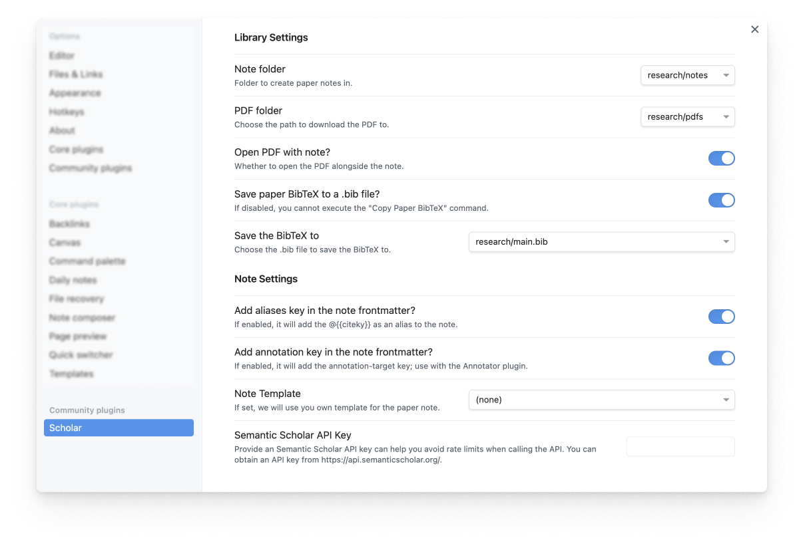

# Obsidian Scholar

## Usage  

### Key Features

| Stage | Function | 
| --- | --- |
| | 📚 Streamline Library Management | 
| **Add Paper from External Link** | Upon seeing a paper on the web (Slack, Twitter, etc.), you can add the paper to your local library: running this tool can download the paper PDF, and create the corresponding paper note with paper metadata. <br/>  |
| **Search and Retrieval** | You can quickly search and retrieve the papers in your library, as well as optionally query and find papers from SemanticScholar directly if they are not in your library. <br/>  |
| | ✨ Enhance Paper Reading | 
| **Check Paper Reference** |  Obsidian Scholar allows you checking the details of the referred papers without leaving the tool. <br/>  |
| **Copy Paper BibTex** |  |

## Installation 

### Install from Obsidian Plugin Library 

This plugin is released on the Obsidian Plugin Library. You can install it directly from the Obsidian app [by searching `Scholar` in the community plugins](https://obsidian.md/plugins?search=scholar). 

### Manual Installation 

1. Open the `.obsidian/plugins` folder in your vault
2. Create a folder called `scholar` 
3. Download the three files `manifest.json`, `styles.css`, and `main.js` from the [latest release](https://github.com/lolipopshock/obsidian-scholar/releases/latest), and put the files in the `.obsidian/plugins/scholar` folder you just created. 
4. Open Obsidian and in `settings > community plugins`, find `Scholar` and enable the plugin. Be sure to change the `Scholar` settings properly before use. 

## Documentation

### Settings 



- **Adding an SemanticScholar API Key**
  Sometimes you might experience rate limiting when querying papers from SemanticScholar. To avoid this, you can add your own SemanticScholar API key in the settings. You can obtain the API Key [here](https://www.semanticscholar.org/product/api#api-key).

## Motivation and Acknowledgement 

The goal of *Obsidian Scholar* is to create a smooth experience that spans from paper reading, note taking, and reflection and synthesis. 
The construction is based on two powerful ideas. 
- **[Annotated Bibliography](https://owl.purdue.edu/owl/general_writing/common_writing_assignments/annotated_bibliographies/annotated_bibliography_samples.html)** that takes short notes for papers and summarizes the key points in your personal bibliography.
- **[Zettlekasten](https://zettelkasten.de/)** note taking system that aims to take atomic and short notes and link them together. 

In *Obsidian Scholar*, we treat each paper as an individual note---we make it painless to ingest the paper PDF and create the note file---and the Obsidian app makes it easy to link paper notes and helps you to reflect and synthesize the knowledge. 

The development of the tools are inspired by many predecessors that are implemented in EMACS. 
- [citar](https://github.com/emacs-citar/citar): A reference manager work in EMACS. 
- [elfeed](https://github.com/skeeto/elfeed): A RSS reader in EMACS.
- [elfeed-score](https://github.com/sp1ff/elfeed-score): A RSS reader with scoring function in EMACS.

Also thanks the following people for their excellent blogposts and tutorials illustrating their paper reading workflow:
- [Managing a research workflow (bibliographies, note-taking, and arXiv)](https://emacsconf.org/2021/talks/research/) by [Ahmed Khaled](https://www.akhaled.org)
- [Managing ArXiv RSS Feeds in Emacs](https://cundy.me/post/elfeed/) by [Chris Cundy](https://cundy.me)

Some of the code is based on a previous project called [paper-note-filer](https://github.com/chauff/paper-note-filler) by [Claudia Hauff](https://chauff.github.io). 


## API Documentation

The Scholar plugin exposes a JavaScript API that can be used by other plugins or through Obsidian URIs. Access the API through `this.app.plugins.plugins.scholar.api`.

### Available Methods

#### `createPaperNoteFromUrl(url: string)`
Creates a paper note from a URL. Supports ArXiv and SemanticScholar URLs.

**Parameters:**
- `url` (string): The URL of the paper to create a note from

**Returns:** `Promise<void>`

**Example:**
```javascript
await this.app.plugins.plugins.scholar.api.createPaperNoteFromUrl("https://arxiv.org/abs/1706.03762");
```

#### `isPaperInLibrary(searchParams: PaperLibrarySearchParams)`
Checks if a paper exists in your library and returns detailed information about it.

**Parameters:**
- `searchParams` (object): Search parameters with the following optional fields:
  - `url?: string` - Paper URL
  - `title?: string` - Paper title
  - `citekey?: string` - BibTeX cite key
  - `bibstring?: string` - BibTeX string

**Returns:** `Promise<PaperLibraryCheckResult>`
- `isInLibrary: boolean` - Whether the paper exists in your library
- `filePath?: string` - Path to the paper note file (if found)
- `paperData?: StructuredPaperData` - Complete paper metadata (if found)

**Example:**
```javascript
// Search by title
const result = await this.app.plugins.plugins.scholar.api.isPaperInLibrary({
    title: "Attention Is All You Need"
});

// Search by URL
const result = await this.app.plugins.plugins.scholar.api.isPaperInLibrary({
    url: "https://arxiv.org/abs/1706.03762"
});

// Search by citekey
const result = await this.app.plugins.plugins.scholar.api.isPaperInLibrary({
    citekey: "vaswani2017attention"
});
```

#### `openPaper(searchParams: OpenPaperParams)`
Opens the paper search modal with pre-filled query or creates a paper note directly from URL.

**Parameters:**
- `searchParams` (object): Search parameters with the following optional fields:
  - `title?: string` - Paper title to search for
  - `bibstring?: string` - BibTeX string to parse
  - `url?: string` - Paper URL to create note from directly

**Returns:** `Promise<void>`

**Example:**
```javascript
// Open search modal with title
await this.app.plugins.plugins.scholar.api.openPaper({
    title: "attention is all you need"
});

// Create paper note from URL
await this.app.plugins.plugins.scholar.api.openPaper({
    url: "https://arxiv.org/abs/1706.03762"
});

// Parse BibTeX and open appropriate action
await this.app.plugins.plugins.scholar.api.openPaper({
    bibstring: "Tom B Brown, Benjamin Mann, Nick Ryder, Melanie Subbiah, Jared Kaplan, Prafulla Dhariwal, Arvind Neelakantan, Pranav Shyam, Girish Sastry, Amanda Askell, et al. 2020. Language models"
});
```

### Quick Testing with Obsidian URIs

You can test the API directly through Obsidian URIs. Copy and paste these URLs into your browser (while Obsidian is running) to test the functionality:

**Test if a paper is in your library by title:**
```
obsidian://adv-uri?eval=this.app.plugins.plugins.scholar.api.isPaperInLibrary%28%7Btitle%3A%22attention%20transformer%22%7D%29.then%28result%20%3D%3E%20console.log%28result%29%29
```

**Test if a paper is in your library by URL:**
```
obsidian://adv-uri?eval=this.app.plugins.plugins.scholar.api.isPaperInLibrary%28%7Burl%3A%22https%3A%2F%2Farxiv.org%2Fabs%2F1706.03762%22%7D%29.then%28result%20%3D%3E%20console.log%28result%29%29
```

**Create a paper note from ArXiv URL:**
```
obsidian://adv-uri?eval=this.app.plugins.plugins.scholar.api.createPaperNoteFromUrl%28%22https%3A%2F%2Farxiv.org%2Fabs%2F1706.03762%22%29.then%28%28%29%20%3D%3E%20console.log%28%22Paper%20created%22%29%29
```

**Open search modal with pre-filled title:**
```
obsidian://adv-uri?eval=this.app.plugins.plugins.scholar.api.openPaper%28%7Btitle%3A%22attention%20is%20all%20you%20need%22%7D%29.then%28%28%29%20%3D%3E%20console.log%28%22Modal%20opened%22%29%29
```

**Test with BibTeX string:**
```
obsidian://adv-uri?eval=this.app.plugins.plugins.scholar.api.openPaper%28%7Bbibstring%3A%22Tom%20B%20Brown%2C%20Benjamin%20Mann%2C%20Nick%20Ryder%2C%20Melanie%20Subbiah%2C%20Jared%20Kaplan%2C%20Prafulla%20Dhariwal%2C%20Arvind%20Neelakantan%2C%20Pranav%20Shyam%2C%20Girish%20Sastry%2C%20Amanda%20Askell%2C%20et%20al.%202020.%20Language%20models%22%7D%29.then%28%28%29%20%3D%3E%20console.log%28%22Action%20completed%22%29%29
```

> **Note:** The URI examples above require the [Advanced URI plugin](https://github.com/Vinzent03/obsidian-advanced-uri) to be installed and enabled. 